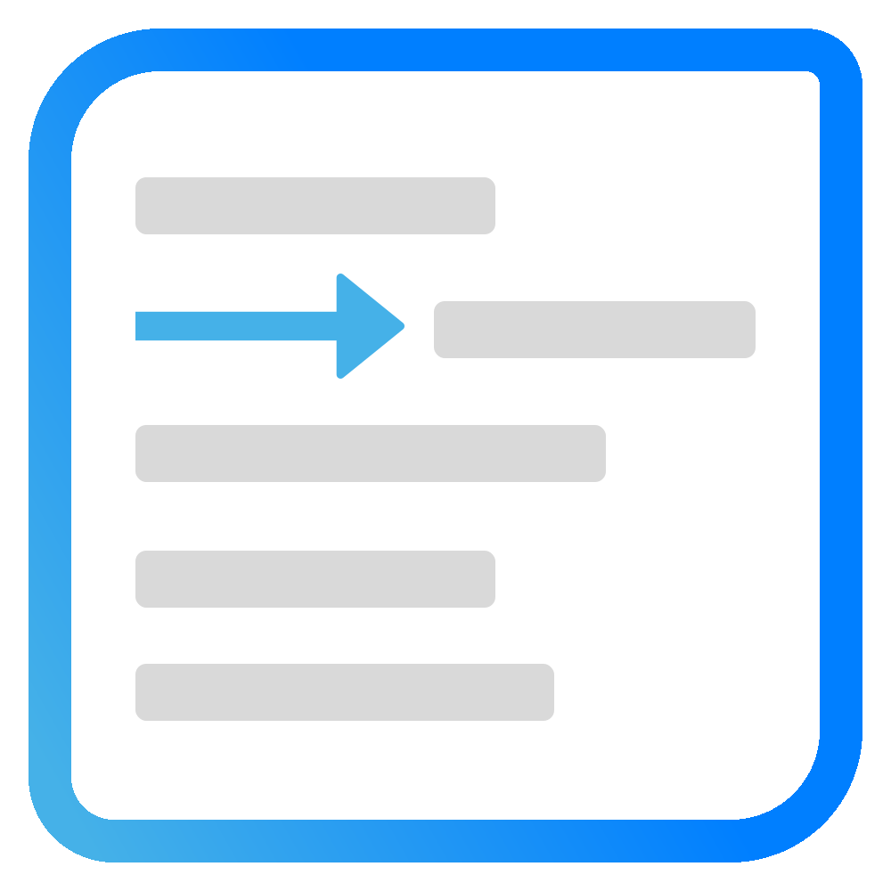

<a id="readme-top"></a>

<h1 align="center">
  <br>
  
  <br>
  TabMate
  <br>
</h1>

---

<p align="center">
    <b>TabMate</b> is a lightweight (~<1KB gzipped), framework-agnostic JavaScript library for enabling tab/indentation behavior to HTML elements like `textarea` — just like in modern code editors.
    <br />
    <a href="https://pboth1304.github.io/tabmate/"><strong>Explore the docs »</strong></a>
</p>

<p align="center">
  <a href="#key-features">Key Features</a> •
  <a href="#getting-started">Getting started</a> •
  <a href="#usage">Usage</a> •
  <a href="#roadmap">Roadmap</a> •
  <a href="#contributing">Contributing</a> •
</p>

<!-- TODO: add GIF -->

## Key Features

- ⌨️ **Smart Tab Key Handling** — Press Tab to insert spaces or tabs where your cursor is, just like in your favorite code editor.
- 🔙 **Shift+Tab Unindent** — Outdent using `Shift+Tab`, even across multiple lines.
- 🔄 **Multiline Indentation** — Select multiple lines and indent/unindent them all at once.
- ⚙️ **Custom Tab Size** — Choose how wide your indent should be: 2 spaces, 4 or even 100 spaces?.
- 🪶 **Zero Dependencies** — Built with modern TypeScript, no external libraries or runtime bloat.

### When to Choose TabMate?

TabMate is the perfect choice when:

- You need proper indentation behavior but don't need a full code editor
- You're building applications where bundle size matters
- You want to enhance textareas in forms, comment sections, or simple editors

**TabMate focuses on doing one thing very well - providing intuitive, code-editor-like indentation behavior for plain HTML elements - without the overhead of more complex solutions.**

## Getting started

To get started, you need to install the npm package like this:

```shell
npm i @tabmate/core
# or
yarn add @tabmate/core
# or
pnpm add @tabmate/core
```

TabMate is exported as ESM and UMD.

## Usage

To start using `tabmate` the only thing you need to do is to attach provide an HTML element to the `tabmate` function like this:

```ts
import { tabmate } from "@tabmate/core";

const textarea = document.querySelector("textarea");
tabmate(textarea, { tabSize: 2 });
```

The second param accepts several configuration options. You can check out all the config options and also some more advanced use cases in the <a href="https://pboth1304.github.io/tabmate/">docs</a>

## Roadmap

- [ ] Smarter indenting (e.g. skipping blank lines)
- [ ] Auto-indentation
- [ ] Direct framework integration for React, Angular & Vue (e.g. by offering a Vue directive you can attach to an HTML element)
- [ ] Allow to add plugins for extra behaviour

## Contributing

If you have a suggestion that would make TabMate better, please fork the repo and create a pull request. You can also simply open an issue with the tag "enhancement".
Don't forget to give the project a star! Thanks again!

## License

This project is licensed under the MIT License - see the [LICENSE](LICENSE) file for details.

<p align="right">(<a href="#readme-top">back to top</a>)</p>
