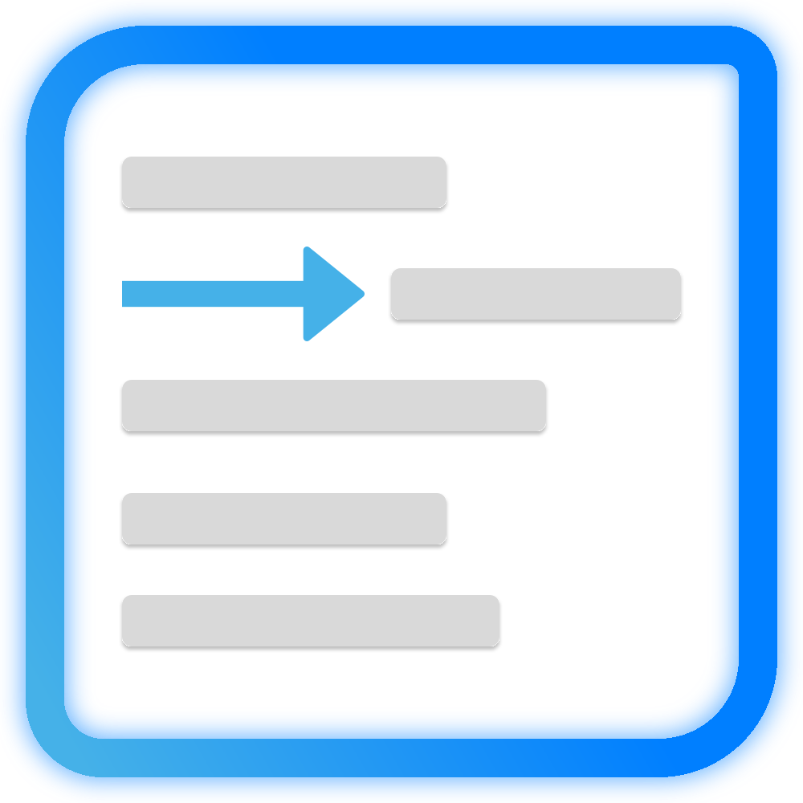
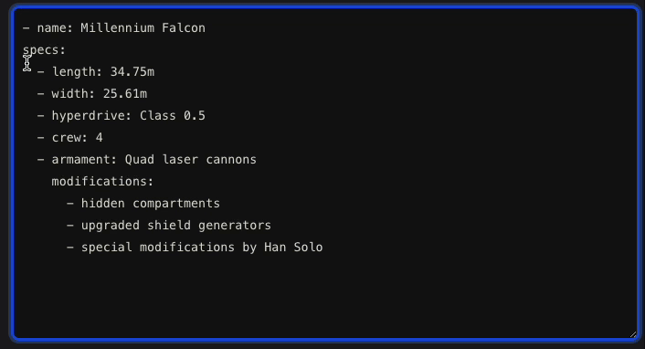

<a id="readme-top"></a>

<h1 align="center">
  <br>
  
  <br>
  TabMate.js
  <br>
</h1>

<p align="center">
    <b>TabMate.js</b> is a lightweight (~<1KB gzipped), framework-agnostic JavaScript library for enabling tab/indentation behavior to HTML elements like textarea — just like in modern code editors.
    <br />
    <a href="https://pboth1304.github.io/tabmate/"><strong>Explore the docs »</strong></a>
</p>

<p align="center">
  <a href="#key-features">Key Features</a> •
  <a href="#getting-started">Getting started</a> •
  <a href="#usage">Usage</a> •
  <a href="#roadmap">Roadmap</a> •
  <a href="#contributing">Contributing</a> •
</p>

<p align="center">
    
</p>

## Key Features

- ⌨️ **Smart Tab Key Handling** — Press Tab to insert spaces or tabs where your cursor is, just like in your favorite code editor.
- 🔙 **Shift+Tab Unindent** — Outdent using `Shift+Tab`, even across multiple lines.
- 🖱️ **Multiline Indentation** — Select multiple lines and indent/unindent them all at once.
- ⚙️ **Custom Tab Size** — Choose how wide your indent should be: 2 spaces, 4 or even 100 spaces?.
- 🪶 **Zero Dependencies** — Built with modern TypeScript, no external libraries or runtime bloat.

### When to Choose TabMate?

TabMate is the perfect choice for you when:

- You need proper indentation behavior but don't need a full code editor
- You're building applications where bundle size matters
- You want to enhance text-areas in forms, comment sections, or simple editors

**TabMate focuses on doing one thing very well - providing intuitive, code-editor-like indentation behavior for plain HTML elements - without the overhead of more complex solutions.**

## Getting started

To get started, you need to install the npm package like this:

```shell
npm i @tabmate/core
# or
yarn add @tabmate/core
# or
pnpm add @tabmate/core
```

TabMate is exported as ESM and UMD.

## Usage

The simplest way to use TabMate is to attach it to a textarea element:

```js
import { tabmate } from "@tabmate/core";

// Get a reference to your textarea
const textarea = document.querySelector("textarea");

// Attach TabMate to the textarea
const instance = tabmate(textarea);

// Now the textarea has enhanced tab behavior!
```

With this basic setup, your textarea will now support:

- Pressing `Tab` to insert spaces
- Pressing `Shift+Tab` to remove indentation
- Multi-line indentation when text is selected

If you want to find out about the configuration options you can pass to the `tabmate` instance you can check the [docs](https://pboth1304.github.io/tabmate/).

### Framework Integration

TabMate is framework-agnostic, but it comes with direct integration for Vue (React and Angular coming soon).

Check out the framework integration section in the [docs](https://pboth1304.github.io/tabmate/) for more information. 

## Roadmap

- [x] Smarter indenting (e.g. skipping blank lines)
- [ ] Auto-indentation
- [x] Direct framework integration for Vue
- [ ] Direct framework integration for React & Angular
- [ ] Allow to add plugins for extra behavior

## Contributing

If you have a suggestion that would make TabMate better, please fork the repo and create a pull request. You can also simply open an issue with the tag "enhancement".
Don't forget to give the project a star! Thanks again!

## License

This project is licensed under the MIT License - see the [LICENSE](LICENSE) file for details.

<p align="right">(<a href="#readme-top">back to top</a>)</p>
